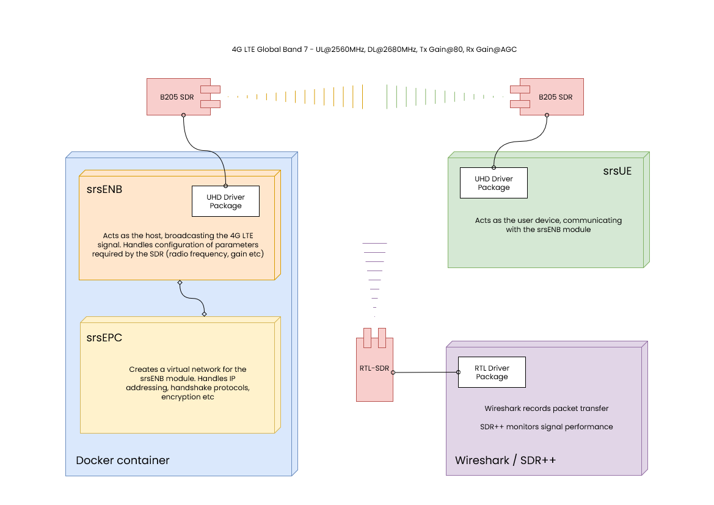

# O-RAN Project
 

> [!NOTE]
> This is a capstone project, not currently intended for external application.
>  
> If you would like to collaborate on development please get in touch!
 

## Summary

Our project aims to streamline the implementation of an open-source 5G small cell base-station, leveraging Software Defined Radios (SDRs) and off-the-shelf hardware. The primary objective is to replicate the functionality described in the paper [T ARXIV.ORG: 2205.13178](research_paper.pdf), utilizing a standard laptop/PC and Ettus Laboratories [B-205-mini SDR](https://www.ettus.com/all-products/usrp-b205mini-i/) (Software Defined Radios) module with appropriate antennas. The secondary objective is the production of detailed documentation on the build process and troubleshooting, to aid in replication and improve usability. 

-   Scope: The project encompasses the emulation of both RAN and mobile core network functionalities using open-source software and SDR technology. We focus on utilizing software components that replicate the functions of proprietary hardware, ensuring compatibility with existing network infrastructures.
  
We give thanks to the AUT Computer Science and Software Engineering faculty, and additional thanks to the following members:

Dr. Bobby Mee Loong Yang 
Prof. Edmund Lai 
Prof. Nurul Sarkar 
Dr. Ramesh Lal 
Dr. Jing Ma 

### Research Team: 
Edward Keith 
Chris Escandor 
Katarina Milicevic 
Sam Cathro  

## Elevator Pitch

The project demonstrates how open-source platforms can establish cost-effective, scalable, and secure telecommunications networks. It explores the practical application of 4G LTE and 5G cellular technologies in educational and research settings, emphasizing automation, documentation, and modularity for easy reproducibility.
 
 

## Project Rationale

5G small cell (pico) base-stations can provide advanced features and standalone capabilities for private networks. There are two main parts of a mobile base-station – the radio access network (RAN) and the mobile core network. These parts are typically bundled and sold as proprietary hardware and software. However, the advance in virtualization technologies and commercial off-the-shelf (COTS) hardware has made it possible to implement such a base station using opensource software and Software Defined Radios (SDR).

Although the technology described by the [O-RAN Alliance](https://www.o-ran.org/) specifications has been defined and implemented successfully within research and development environments, there does not seem to be straightforward and exhaustive documentation on the technical deployment of a network following the O-RAN architecture.

All existing published research appears to be written for the purpose of dissemination within academic circles, assuming a highly specialised technical knowledge of its reader. We propose that the creation of a freely available and comprehensible record of the implementation of a 5G testbed following O-RAN standards will allow other researchers to access and replicate our project, laying the foundation for further groundwork for flexible, interoperable, and non-proprietary mobile networks.

In addition, we believe that the synthesis of such documentation will allow for easier circulation of the O-RAN architecture and its highly promising applications within amateur or hobbyist communities who might otherwise feel intimidated by a perceived high barrier of entry.
 

### Cost Effectiveness

Traditional 5G small cell base-stations rely heavily on proprietary hardware and software solutions, resulting in high deployment and maintenance costs for network operators. By developing an open-source emulation solution, the project aims to significantly reduce these costs, making 5G infrastructure more accessible and affordable for a wider range of organizations.

### Scalability and Flexibility

Proprietary solutions often lack the scalability and flexibility required to adapt to evolving network requirements. The open-source emulation approach allows for greater customization and adaptability, enabling network operators to tailor their infrastructure to specific needs and scale operations more efficiently.

### Compatibility and Interoperability

Existing proprietary systems may face compatibility issues with other network components or protocols, limiting interoperability and hindering seamless integration within larger network ecosystems. The open-source emulation solution aims to address these compatibility challenges by providing standardized interfaces and protocols, enhancing interoperability and facilitating smoother integration with existing network infrastructure.

### Innovation and Collaboration

Open-source projects foster innovation and collaboration within the industry, enabling developers and researchers to contribute to the advancement of 5G technology collectively. By embracing an open-source approach, the project encourages collaboration among industry stakeholders, driving innovation and accelerating the development of next-generation telecommunications solutions.

### Addressing Market Demand

There is a growing demand for cost-effective and flexible 5G infrastructure solutions, particularly in sectors such as smart cities, IoT (Internet of Things), and industrial automation. The project aims to capitalize on this market demand by offering an open-source emulation solution that meets the needs of diverse industry verticals, opening new opportunities for deployment and expansion.

### Overcoming Vendor Lock-In

Vendor lock-in is a common challenge faced by network operators, limiting their ability to switch providers or upgrade equipment without significant cost and disruption. The open-source emulation solution provides an alternative to vendor lock-in, empowering network operators to retain control over their infrastructure and reduce dependency on single vendors.

The project addresses critical issues within the telecommunications industry by offering a cost-effective, scalable, and interoperable solution for implementing 5G small cell base-stations. By embracing open-source principles and fostering collaboration, the project aims to drive innovation, address market demand, and overcome barriers to adoption, ultimately enabling a more accessible and efficient 5G infrastructure landscape.
 
 

## Key Use Cases

### Commercial Applications

- Private LTE/5G Networks for Enterprises: Deploy private networks in factories, campuses, and office environments to enhance productivity, improve IoT integration, and ensure secure internal communications.
- Rural and Remote Connectivity: Provide affordable cellular coverage in underserved regions, bridging the digital divide with minimal infrastructure investment.
- Urban Network Optimization: Address network congestion and enhance coverage in high-density areas by deploying small cells to complement traditional macro networks.
- IoT Integration: Establish dedicated networks for IoT devices, ensuring low-latency and reliable communication for smart homes, agriculture, and logistics.

### Government Applications

- Smart Cities Infrastructure: Enable municipal services such as traffic management, energy grid optimization, and public safety applications through dedicated 5G infrastructure.
- Affordable Public Networks: Deploy cost-effective cellular networks for public use, reducing dependency on large telecommunications providers.
- Critical Infrastructure Monitoring: Use low-latency, private networks to monitor utilities like water, power, and transportation systems.

### Defense Applications

- Secure Battlefield Communications: Implement portable, secure networks for military operations in remote or dynamic environments.
- Base Communications: Support operations at defense installations with private, high-security cellular networks.
- Drone and Autonomous Vehicle Networks: Facilitate secure communication and data sharing between military drones and autonomous systems.
- Cybersecurity Testing Platforms: Simulate and assess vulnerabilities in telecommunications infrastructure under controlled conditions.

### Research & Education

- Telecommunications Research: Provide a platform for studying cellular network architectures, protocols, and security.
- STEM Education: Enable practical learning experiences for students in wireless communications and network engineering.
- Experimentation in Open-Source Solutions: Promote innovation in the use of SDRs and open-source software for emerging network technologies.
- Prototype Testing: Allow startups or researchers to test new network configurations, applications, and security mechanisms.

### Secure Communications

- Whistleblower and Dissident Networks: Provide secure and private communication channels in oppressive regimes.
- Corporate Security: Offer private, encrypted communication systems for sensitive business operations.
- Confidential Healthcare Data: Facilitate secure data transfer in telemedicine and remote healthcare environments.
- NGO and Humanitarian Operations: Create secure, mobile networks for field workers in politically sensitive regions.

### Disaster Relief

- Emergency Response Networks: Deploy portable base stations to restore communication in disaster-hit areas.
- Rapid Recovery: Use private cellular networks for coordinating first responders and relief efforts.
- Remote Monitoring: Enable connectivity for drones or IoT devices in disaster zones to monitor and assess damage.
- Temporary Connectivity: Provide immediate telecommunications infrastructure in areas affected by earthquakes, hurricanes, or other natural disasters.
 
    
## Project Results:

- Host and receiver setup uses the O-RAN architecture to establish LTE connectivity  between the two devices and simulate real-world small cell operations. It consists of SRSeNB/SRSEPC running on one computer, transmitting LTE signals as the host. SRSUE acts as the receiver on another device.
- Both setups operate on Ubuntu 22.04 connected to SDRs with compatible cellular antennas, ensuring accurate and reliable data transmission. Docker containers are pre-configured to enable primary connection with no adjustment by the user.
- Connectivity was validated using ping tests, Apache2 web server access, OpenSSH, and SCP for file transfer between devices. Conducted physical distance testing to observe the testbed’s performance and stability in different environments.
 

### Network Topology:

 

